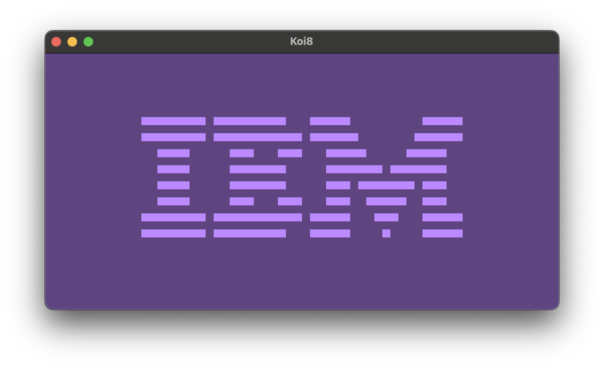

# Koi8
## About
Koi8 is a quick and dirty project to start learning emulation development by creating an interpreter/emulator for the CHIP-8 programming language.
This project uses SFML for windowing/rendering.

Koi8 complies with all the test ROMs that are supplied in the `test-roms` folder. It has not yet been tested with any real games.

## Gallery
### IBM Logo

### Corax's Opcodes Test

### Corax+ Opcodes Test

### Flags Test

## Resources
[Guide to making a Chip-8 emulator - Tobias Langhoff](https://tobiasvl.github.io/blog/write-a-chip-8-emulator/)   
[Building a Chip-8 emulator - Austin Morlan](https://austinmorlan.com/posts/chip8_emulator/)  
[CHIP-8 - Wikipedia](https://en.wikipedia.org/wiki/CHIP-8)  
[chip8-test-suite - github/Timendus](https://github.com/Timendus/chip8-test-suite)